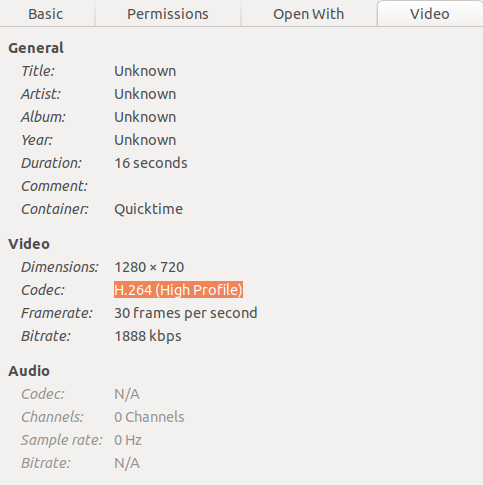
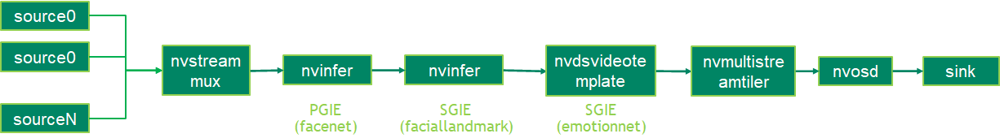

# NVIDIA EmotionNet Models
These examples only works on DS 6.0 / Jetpack 4.6, because EmotionNet needs a special gst plugin.

Reference:\
[Deepstream TAO model donwload](https://github.com/NVIDIA-AI-IOT/deepstream_tao_apps/blob/master/apps/tao_others/README.md).\
[Deepstream Emotion App](https://github.com/NVIDIA-AI-IOT/deepstream_tao_apps/tree/master/apps/tao_others/deepstream-emotion-app).

# Download code and models
Clone repo:
```sh
$ git clone https://github.com/NVIDIA-AI-IOT/deepstream_tao_apps
$ sudo chmod -R 777 deepstream_tao_apps
$ cd deepstream_tao_apps 
```
Download tlt-converter for Jetson Jetpack 4.6
```sh
$ wget https://developer.nvidia.com/jp46-20210820t231431z-001zip -O tao-converter-jp46-trt8.0.1.6.zip
$ unzip tao-converter-jp46-trt8.0.1.6.zip
$ rm tao-converter-jp46-trt8.0.1.6.zip
```

Download models:
```sh
$ export TAO_CONVERTER=/opt/nvidia/deepstream/deepstream/sources/deepstream_tao_apps/tao-converter-jp46-trt8.0.1.6
$ export MODEL_PRECISION=fp16
$ ./download_models.sh
```

# Build lib for emotion
```sh
$ cd /opt/nvidia/deepstream/deepstream/sources/gst-plugins/gst-nvdsvideotemplate
$ sudo CUDA_VER=10.2 make
$ sudo cp libnvdsgst_videotemplate.so /opt/nvidia/deepstream/deepstream/lib/gst-plugins/
$ sudo rm -rf ~/.cache/gstreamer-1.0/
```

# Build deepstream-app
```sh
$ cd /opt/nvidia/deepstream/deepstream/sources/deepstream_tao_apps/apps/tao_others/deepstream-emotion-app/emotion_impl
$ sudo CUDA_VER=10.2 make
$ cd ../
$ sudo CUDA_VER=10.2 make
```

# Video input (important)
The uribindecode for h264 o mp4 is specting the "High Profile":



In case your video "in.mp4" or "in.h264" has another profile, like "High Profile 4:2:2" you need to convert it with:
```sh
$ ffmpeg -i in.mp4 -c:v libx264 -profile:v high -level:v 4.0 -pix_fmt yuv420p -c:a copy out.mp4 -y
```

# Video output framerate error
If the video generator was saved without framerate specification, change it with:
```sh
$ ffmpeg -i out.mp4 -filter:v fps=fps=10 out_new.mp4
```

# EmotionNet



### Build deepstream-app
```sh
$ cd /opt/nvidia/deepstream/deepstream/sources/deepstream_tao_apps/apps/tao_others/deepstream-emotion-app/emotion_impl
$ sudo CUDA_VER=10.2 make
$ cd ../
$ sudo CUDA_VER=10.2 make
```

### Run example

Parameters:
- ./deepstream-emotion-app arg[1] arg[2] arg[3]
- arg[1] --> output sink type [1:file sink |2:fakesink |3:display sink]
- arg[2] --> config file
- arg[3] --> input file [jpg/png | h264]
- arg[4] --> output filename (without extension)

```sh
$ export LD_LIBRARY_PATH=$LD_LIBRARY_PATH:/opt/nvidia/deepstream/deepstream/lib/cvcore_libs
$ ./deepstream-emotion-app 1 ../../../configs/facial_tao/sample_faciallandmarks_config.txt file://<absolute path> ./output
```

# GazenNet
Reference:\
[How to visualise the 3D gase vector output](https://forums.developer.nvidia.com/t/how-to-visualise-the-3d-gaze-vector-output-of-the-gazenet-model/200303)


### Build deepstream-app
```sh
$ cd /opt/nvidia/deepstream/deepstream/sources/deepstream_tao_apps/apps/tao_others/deepstream-gaze-app/gazeinfer_impl
$ sudo CUDA_VER=10.2 make
$ cd ../
$ sudo CUDA_VER=10.2 make
```

### Run example

Parameters:
- ./deepstream-emotion-app arg[1] arg[2] arg[3]
- arg[1] --> output sink type [1:file sink |2:fakesink |3:display sink]
- arg[2] --> config file
- arg[3] --> input file [jpg/png | h264]
- arg[4] --> output filename (without extension)

```sh
$ export LD_LIBRARY_PATH=$LD_LIBRARY_PATH:/opt/nvidia/deepstream/deepstream/lib/cvcore_libs
$ ./deepstream-gaze-app 1 ../../../configs/facial_tao/sample_faciallandmarks_config.txt file://<absolute path> ./output
```

## Run example and draw eye vector
```sh
$ ./deepstream-gaze-app 1 ../../../configs/facial_tao/sample_faciallandmarks_config.txt file://<absolute path> ./output |tee log.txt
```


