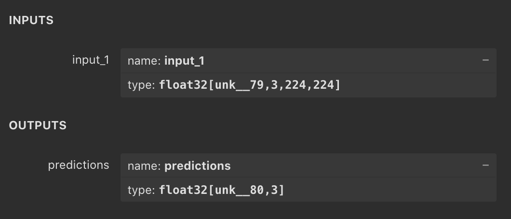

# Keras to Deepstream with Mobilenet as a classifier


# Description
In this example we are creating an untrained classifier Mobilenet model with Keras, translating it to ONNX format and using it in Deepstream.

## Requirements
For the requirements, please refer to the main curated documentation on how to install them.
| Package    | Version |
| ---------- | ------- |
| Jetpack    | 4.5.1   |
| Python     | 3.6.9   |
| Deepstream | 5.1     |
| Tensorflow | 2.4.0   |
| Keras      | 2.4.0   |
| TensorRT   | 7.1.3   |
| tf2onnx    | 1.9.2   |
| ONNX       | 1.10.1  |

## How to run
After getting all the dependencies installed, we are going to execute the following steps:
1. Change channel setting in ~/.keras/keras.json
    {
        "floatx": "float32",
        "epsilon": 1e-07,
        "backend": "tensorflow",
        "image_data_format": "channels_first"
    }
1. Generate new model
    ```sh
    python3 generate_model.py
    ```
2. Execute deepstream pipeline with deepstream-app
    ```sh
    deepstream-app -c configs/deepstream_config.txt
    ```

# Considerations

One of the most important things to get right are the layer input and output names. For this, it's very useful to use [The Netron App](https://netron.app) to check every layer's name.

You will need to take note on both input and output layers' names.

and use them in the configuration file for each respective model. In this case we used the config_infer_secondary_mobilenet.txt in the **field output-blob-names**.