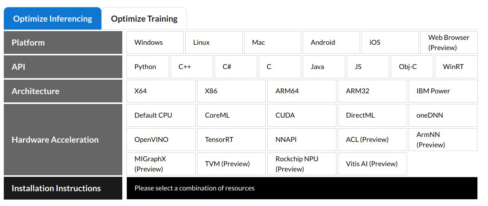

# ONNX Runtime scripts
<p align="center"></p>

# Description
In this folder you will find examples of how to use onnx runtime to make inference with ONNX models
| Package      | Version   |
| ----------   | -------   |
| ONNX         | >=1.4.1   |
| ONNX runtime | >=1.10.0  |

In case that example doesnt show how to install ONNX default RUNTIME, use the following command:
```sh
$ python3 -m pip install onnxruntime
```

# ONNX Runtime for GPU/Cuda/CPU
ONNX runtime support optimiez runtime inference for differents platforms, checkout the following link:

[ONNX Runtime optimize inferencing](https://onnxruntime.ai/)




